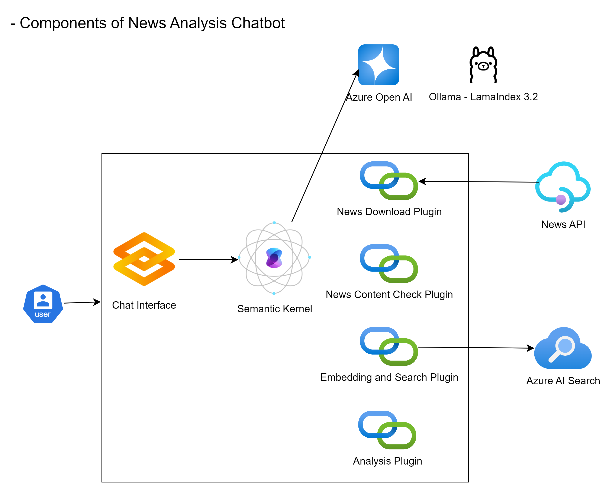
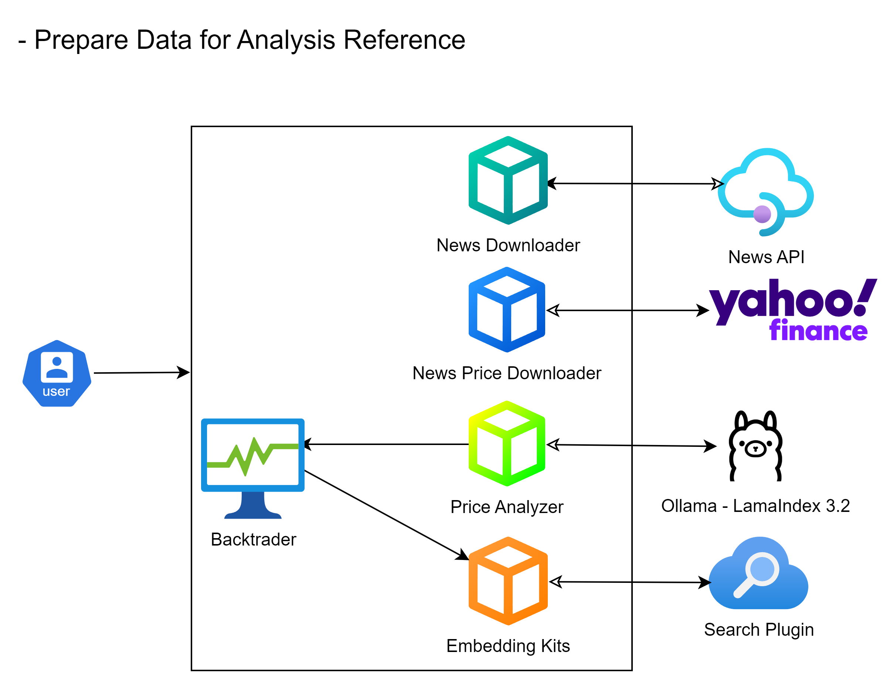

# Stock News Analyzer

## Project Structure

This project consists of two main components:
1. **UI Chatbot** - An interactive chatbot interface for analyzing stock-related news.
2. **Data Feeder** - A data collection module that fetches historical stock news and prices for analysis.

## Purpose

Stock News Analyzer is designed to analyze financial news and assess its impact on stock prices. The system processes news articles, extracts relevant information, and evaluates how the sentiment and content of the news influence the stock performance of the respective companies.

## Special Feature

This project provides an example of an innovative approach where past financial news can be collected and incorporated as a reference for Large Language Models (LLMs). By integrating backtesting of past news data, the system helps LLMs predict market movements or impacts more accurately when new news arrives. We anticipate that this approach will serve as a valuable background reference, enabling users to make more informed decisions based on historical market trends.

## Installation

First, install the required dependencies:

```sh
pip install -r requirements.txt
```

## Launch

### Start the Chat UI
To start the application, run the following command:

```sh
python ui/stock_news_chat_ui.py
```

### Start the Data Feeder
To launch the data feeder, run:

```sh
python feeder/news_price_data_feeder.py
```

## Project Overview

### Architecture



### Data Feeder


